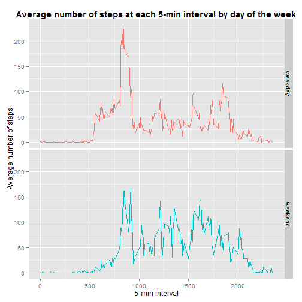

Reproducible Research: Peer Assessment 1
========================================================

## Loading and preprocessing the data


```r
# Load data unzipped data from work directory
activity <- read.csv("./activity.csv")

# Transform 'date' char variable to POSIXlt
activity$date <- strftime(activity$date, format = "%Y-%m-%d", usetz = FALSE)
```


## What is mean total number of steps taken per day?


```r
# Calculate the total number of steps taken each day
stepsEachDay <- tapply(activity$steps, activity$date, sum, na.rm = TRUE)

# Histogram of the total number of steps taken each day
library(ggplot2)
qplot(stepsEachDay, geom = "histogram") + geom_histogram(aes(fill = ..count..)) + 
    labs(x = "Total steps taken each day", y = "Frequency count") + guides(fill = FALSE) + 
    ggtitle("Frequency of total steps taken each day") + theme(plot.title = element_text(lineheight = 0.8, 
    face = "bold"))
```

 


```r
# Calculate the mean and median total number of steps taken per day
meanSteps <- mean(stepsEachDay)
medianSteps <- median(stepsEachDay)
```


The mean total number of steps taken each day is: **9354.2295**  
The median total number of steps taken each day is: **10395**  
`NA`s were removed in both calculations.

## What is the average daily activity pattern?


```r
# Calculate the average number of steps taken at each 5-min across all days
averageActivity <- tapply(activity$steps, activity$interval, mean, na.rm = TRUE)
averageActivityInterval <- as.data.frame(cbind(unique(activity$interval), averageActivity))
colnames(averageActivityInterval) <- c("interval", "averageSteps")

# Time series plot of the 5-minute interval (x-axis) and the average number
# of steps taken, averaged across all days (y-axis)
ggplot(data = averageActivityInterval, aes(x = interval, y = averageSteps, color = "")) + 
    geom_line() + guides(color = FALSE) + labs(x = "5-minute intervals", y = "Average number of steps") + 
    ggtitle("Average number of steps at each 5-min interval") + theme(plot.title = element_text(lineheight = 0.8, 
    face = "bold"))
```

 


```r
# 5-minute interval, on average across all the days in the dataset, with the
# maximum number of steps
maxInterval <- which.max(averageActivity)
maxInterval <- names(maxInterval)
```


The maximum average number of steps across all days is: **835**

## Imputing missing values


```r
# Calculate the total number of missing values in the dataset
numNAs <- sum(is.na(activity$steps))
```


The total number of missing values in the dataset is: **2304**  
  
Imputting strategy: Replace missing values (`NA`) with mean for the average number of steps at each 5-min interval across all days


```r
# Replace NA values with mean for the average number of steps at each 5-min
# interval
newActivity <- activity
naPos <- which(is.na(activity[, 1]))
matchingIntervals <- activity$interval[naPos]
matchingIntervals <- match(matchingIntervals, averageActivityInterval[, 1])
newActivity$steps[naPos] <- averageActivityInterval[matchingIntervals, 2]
```


```r
# Create a new dataset that is equal to the original dataset but with the
# missing data filled in
newStepsEachDay <- tapply(newActivity$steps, newActivity$date, sum, na.rm = TRUE)
```


```r
# Histogram of the total number of steps taken each day for new datatset
qplot(newStepsEachDay, geom = "histogram") + labs(x = "Total steps taken each day", 
    y = "Frequency count") + geom_histogram(aes(fill = ..count..)) + guides(fill = FALSE) + 
    ggtitle("Frequency of total steps taken each day") + theme(plot.title = element_text(lineheight = 0.8, 
    face = "bold"))
```

 

```r
# Calculate the mean and median total number of steps taken per day for new
# dataset
newMeanSteps <- mean(newStepsEachDay)
newMedianSteps <- median(newStepsEachDay)
```


The mean total number of steps taken each day using the new dataset is **1.0766 &times; 10<sup>4</sup>**  
The median total number of steps taken each day using the new datatset is  **1.0766 &times; 10<sup>4</sup>**  
  
Both mean and median are larger than the values from calculated from the original dataset.
Replacing missing values with mean for the average number of steps at each interval caused both the mean and median
to coincide at the same value.

## Are there differences in activity patterns between weekdays and weekends?

```r
# Create a new factor variable in the dataset with two levels: 'weekday' and
# 'weekend'
newActivity$date <- strptime(newActivity$date, format = "%Y-%m-%d")
newActivity$weekday <- weekdays(newActivity$date)
weekday <- c("Monday", "Tuesday", "Wednesday", "Thursday", "Friday")
weekend <- c("Saturday", "Sunday")
newActivity$weekday[(newActivity$weekday %in% weekday)] <- "weekday"
newActivity$weekday[(newActivity$weekday %in% weekend)] <- "weekend"
newActivity$weekday <- factor(newActivity$weekday, levels = c("weekday", "weekend"))
```


```r
# Calculate the average number of steps taken at each 5-min across weekdays
# & weekends
s <- split(newActivity, newActivity$weekday)
s2 <- lapply(s, function(s) tapply(s$steps, s$interval, mean))
s3 <- do.call(rbind.data.frame, s2)  #convert list to data frame
averageStepsbyWeekday <- t(s3)  #transpose data frame
row.names(averageStepsbyWeekday) <- (averageActivityInterval$interval)
averageStepsbyWeekday <- as.data.frame(averageStepsbyWeekday)

# Convert 'weekend' and 'weekday' columns to factor levels
library(reshape2)
averageStepsbyWeekday2 <- melt(averageStepsbyWeekday)
averageStepsbyWeekday2$interval <- (averageActivityInterval$interval)
colnames(averageStepsbyWeekday2) <- c("day", "averageSteps", "interval")

# Time series plot comparing the average number of steps during 'weekday'
# and 'weekend' days
library(ggplot2)
ggplot(data = averageStepsbyWeekday2, aes(x = interval, y = averageSteps, color = day)) + 
    geom_line() + facet_grid(day ~ .) + guides(color = FALSE) + labs(x = "5-min interval", 
    y = "Average number of steps") + ggtitle("Average number of steps at each 5-min interval by day of the week") + 
    theme(plot.title = element_text(lineheight = 0.8, face = "bold"))
```

 


The subject seems to be more active during weekdays' mornings and not so much during the rest of the day. In contrast, the subject's activity pattern seems more uniform throughout the day over the weekends.


